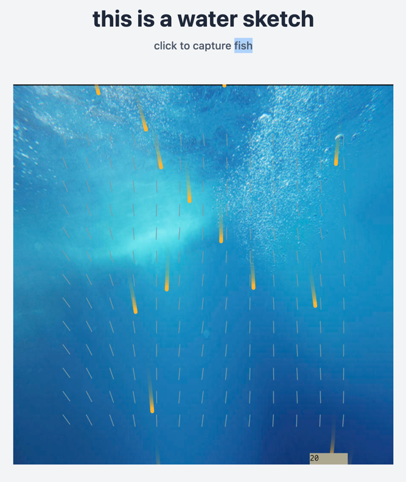

# perlin pachinko

## Run locally

1. Copy the template to your github.
1. Install `pnpm install`
1. Run  `pnpm run dev`

# Credits

* `Inconsolata` font included for demonstration purposes; [Inconsolata font license](https://www.fontsquirrel.com/license/Inconsolata).
* favicon from [svg repo](https://www.svgrepo.com/svg/190855/water-drop-water)
